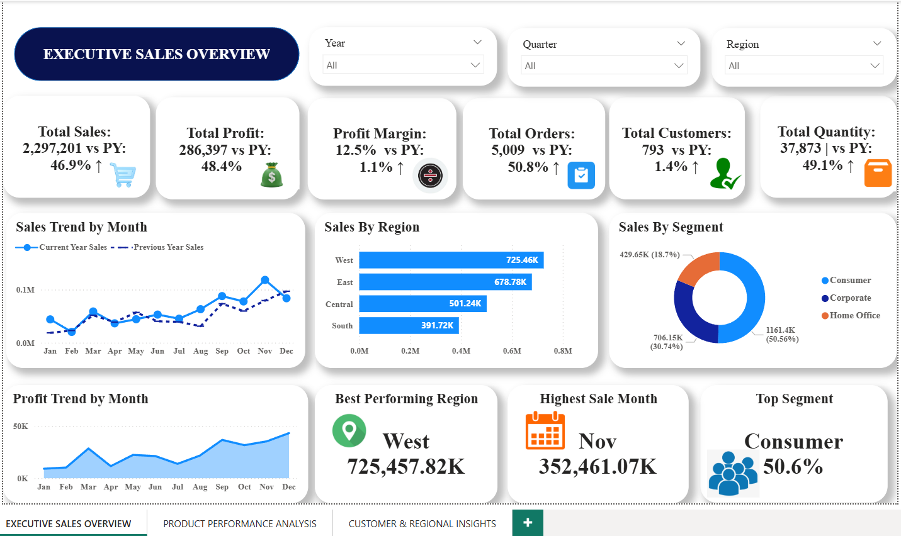
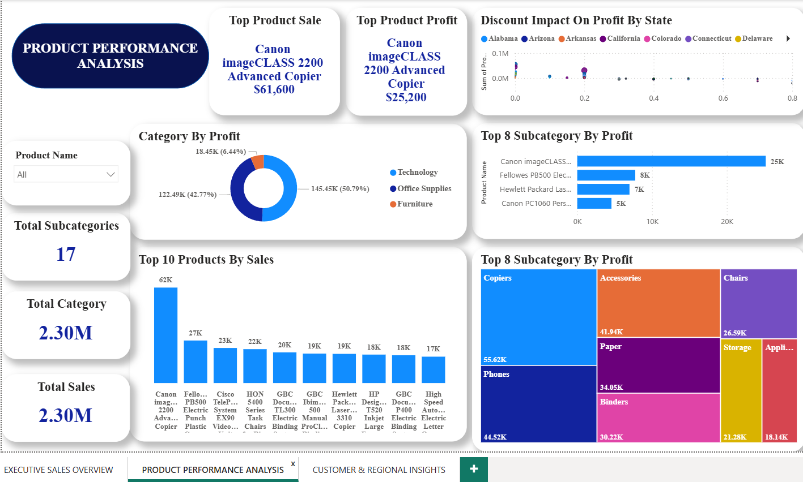
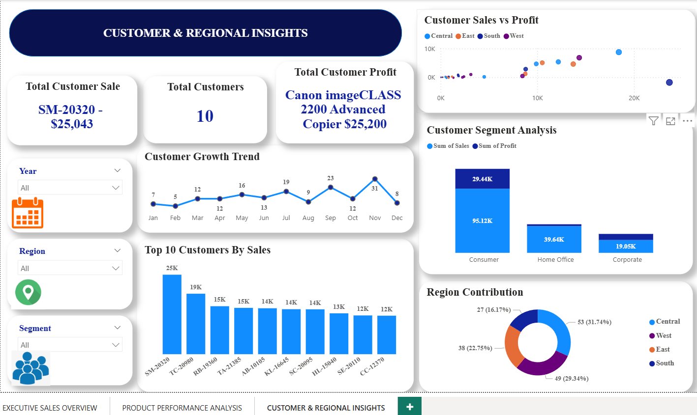

# Superstore Sales Analytics Dashboard | Power BI

## Project Overview

This project is an interactive Power BI dashboard built using the Superstore dataset. It provides valuable insights into sales performance, profitability, customer behavior, product performance, and regional trends.

The goal of this project is to transform raw sales data into meaningful business insights through interactive dashboards and data visualization.

---

## Tools Used

- Power BI
- Microsoft Excel
- Power Query
- DAX (Data Analysis Expressions)
- Data Modeling

---

## Dataset

The dataset includes:

- Order Details
- Customer Information
- Product Information
- Sales
- Profit
- Quantity
- Discount
- Region
- Segment
- Order Date

---

## Executive Sales Overview

This dashboard provides a high-level overview of business performance through KPIs, monthly sales and profit trends, regional sales analysis, customer segmentation, and executive insights.

---

## Product Performance Analysis

This dashboard focuses on product performance by identifying top-selling and most profitable products, category-wise profit, discount impact on profit, and sub-category analysis.

---

## Customer & Regional Insights

This dashboard analyzes customer behavior and regional performance, including customer growth trends, top customers by sales and profit, customer segmentation, sales vs. profit analysis, and regional contribution.

---

## Key Insights

- Consumer segment generated the highest sales.
- The West region achieved the highest overall sales.
- Technology products contributed the highest profit.
- Top-performing products generated a significant share of total revenue.
- Discount levels influenced product profitability.
- Customer purchasing trends varied across different months.

---

## Skills Demonstrated

- Power BI Dashboard Development
- Power Query
- DAX
- Data Modeling
- KPI Development
- Data Visualization
- Business Intelligence
- Business Storytelling

---

## Project Outcome

This project demonstrates the ability to build an end-to-end business intelligence dashboard that helps stakeholders monitor KPIs, identify trends, and make data-driven business decisions.

---

## Author

**Aysha Fina**

Aspiring Data Analyst

**Skills:** Power BI | SQL | Python | Excel | DAX
